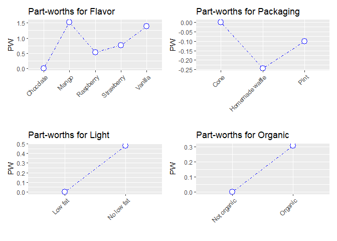

Ratings Based Product Conjoint Analysis
================
Njabulo Hlabangana
2022-08-06

## Introduction

Conjoint analysis is one of the most powerful and widely used tool in
market research. Almost every major market research consulting firm has
professionals capable of conducting conjoint analysis. It is basically a
statistical technique used to determine consumer preferences for
products or services. It uses a de-compositional approach that breaks
down a product into its salient features known as **attributes**.
Attributes in this case refer to the key characteristics of a
product/service that consumers use to make their purchase decisions. The
consumer preferences are obtained using different kinds of surveys but
of late online surveys are the main tool used.

In this exercise I use ice cream as an example. The attributes used are
Flavor, Packaging, Organic (Whether its organic or not) and
Light(Whether its Low fat or not). Each attribute has what are known as
**levels** which are essentially different amounts or classes of that
particular attribute. For instance, in the case of the icecream example,
the attribute Flavor has Mango, Raspberry, Chocolate, Vanilla and
Strawberry as its levels. A particular combination of attribute levels
constitute a **product profile** e.g a low fat organic vanilla cone ice
cream.

The aim of this study is to determine 1) the importance of each
attribute in the consumer decision making process 2) which product
profile is the most preferred in the market 3) predict the ratings of
other product profiles that were not part of the survey 4) estimate the
market shares of some selected products.

``` r
library(radiant) # used to access the conjoint function
library(tidyverse) #used for manipulation of data frames
```

## Data

In this data set, 15 consumers where asked to each rate 10 ice cream
profiles on a scale of 1 to 10 - 1 being the least and 10 being the
best.Below is a look at the first 10 rows of the dataframe.

``` r
setwd('/Users/hlaba/Documents/Custom Office Templates')
icecream <- read.csv('Ice cream.csv')
head(icecream,10)
```

    ##    Observations    Flavor       Packaging      Light     Organic    Respondent
    ## 1     Profile 1 Raspberry Homemade waffle No low fat Not organic  Individual 1
    ## 2     Profile 1 Raspberry Homemade waffle No low fat Not organic  Individual 2
    ## 3     Profile 1 Raspberry Homemade waffle No low fat Not organic  Individual 3
    ## 4     Profile 1 Raspberry Homemade waffle No low fat Not organic  Individual 4
    ## 5     Profile 1 Raspberry Homemade waffle No low fat Not organic  Individual 5
    ## 6     Profile 1 Raspberry Homemade waffle No low fat Not organic  Individual 6
    ## 7     Profile 1 Raspberry Homemade waffle No low fat Not organic  Individual 7
    ## 8     Profile 1 Raspberry Homemade waffle No low fat Not organic  Individual 8
    ## 9     Profile 1 Raspberry Homemade waffle No low fat Not organic  Individual 9
    ## 10    Profile 1 Raspberry Homemade waffle No low fat Not organic Individual 10
    ##    Rating
    ## 1       1
    ## 2       6
    ## 3       5
    ## 4       1
    ## 5       2
    ## 6       7
    ## 7       7
    ## 8       5
    ## 9       1
    ## 10     10

## Conjoint Analysis

The conjoint function of the radiant package is used to model respondent
preferences based on the ratings given. The summary of output is given
below.

``` r
conjoint_allrespondents <- conjoint(icecream, rvar = "Rating", evar = c("Flavor","Packaging","Light","Organic")) 
summary(conjoint_allrespondents)
```

    ## Conjoint analysis
    ## Data                 : icecream 
    ## Response variable    : Rating 
    ## Explanatory variables: Flavor, Packaging, Light, Organic 
    ## 
    ## Conjoint part-worths:
    ##    Attributes          Levels     PW
    ##  Flavor       Chocolate        0.000
    ##  Flavor       Mango            1.522
    ##  Flavor       Raspberry        0.522
    ##  Flavor       Strawberry       0.767
    ##  Flavor       Vanilla          1.389
    ##  Packaging    Cone             0.000
    ##  Packaging    Homemade waffle -0.244
    ##  Packaging    Pint            -0.100
    ##  Light        Low fat          0.000
    ##  Light        No low fat       0.478
    ##  Organic      Not organic      0.000
    ##  Organic      Organic          0.307
    ##  Base utility ~                4.358
    ## 
    ## Conjoint importance weights:
    ##  Attributes    IW
    ##   Flavor    0.597
    ##   Packaging 0.096
    ##   Light     0.187
    ##   Organic   0.120
    ## 
    ## Conjoint regression results:
    ## 
    ##                            coefficient
    ##  (Intercept)                     4.358
    ##  Flavor|Mango                    1.522
    ##  Flavor|Raspberry                0.522
    ##  Flavor|Strawberry               0.767
    ##  Flavor|Vanilla                  1.389
    ##  Packaging|Homemade waffle      -0.244
    ##  Packaging|Pint                 -0.100
    ##  Light|No low fat                0.478
    ##  Organic|Organic                 0.307

The output helps to answer the first question about attribute
importance. This is given as weights given to each attribute by the
respondent in the decision making process. Flavour - with an importance
weight of 59 % is by far the most important of the four attributes,
followed by Light(low fat or not) with an importance weight of 18.7 %,
then Organic with a weight of 12 %. The least important of the four is
packaging with a weight of 9.6 %.

## Part-worth (utility) plots

Part-worth plots are used to visualize the estimated utilities
(satisfaction derived by the consumer) of each factor level. Total
utility for each product profile is the sum total of the utilities of
its constituent attribute levels. Based on the part-worth plot below, it
is clear that the most preferred profile is a Full fat organic Mango ice
cream in a cone.

``` r
plot(conjoint_allrespondents)
```

<!-- -->

``` r
flavor <- unique(icecream$Flavor)
packaging <- unique(icecream$Packaging)
light <- unique(icecream$Light)
organic <- unique(icecream$Organic)
all_profiles <- expand.grid(flavor,packaging,light,organic)
attr <- c("Flavor", "Packaging", "Light","Organic")
all_profiles <-`colnames<-`(all_profiles,attr)

print(all_profiles)
```

    ##        Flavor       Packaging      Light     Organic
    ## 1   Raspberry Homemade waffle No low fat Not organic
    ## 2   Chocolate Homemade waffle No low fat Not organic
    ## 3  Strawberry Homemade waffle No low fat Not organic
    ## 4     Vanilla Homemade waffle No low fat Not organic
    ## 5       Mango Homemade waffle No low fat Not organic
    ## 6   Raspberry            Cone No low fat Not organic
    ## 7   Chocolate            Cone No low fat Not organic
    ## 8  Strawberry            Cone No low fat Not organic
    ## 9     Vanilla            Cone No low fat Not organic
    ## 10      Mango            Cone No low fat Not organic
    ## 11  Raspberry            Pint No low fat Not organic
    ## 12  Chocolate            Pint No low fat Not organic
    ## 13 Strawberry            Pint No low fat Not organic
    ## 14    Vanilla            Pint No low fat Not organic
    ## 15      Mango            Pint No low fat Not organic
    ## 16  Raspberry Homemade waffle    Low fat Not organic
    ## 17  Chocolate Homemade waffle    Low fat Not organic
    ## 18 Strawberry Homemade waffle    Low fat Not organic
    ## 19    Vanilla Homemade waffle    Low fat Not organic
    ## 20      Mango Homemade waffle    Low fat Not organic
    ## 21  Raspberry            Cone    Low fat Not organic
    ## 22  Chocolate            Cone    Low fat Not organic
    ## 23 Strawberry            Cone    Low fat Not organic
    ## 24    Vanilla            Cone    Low fat Not organic
    ## 25      Mango            Cone    Low fat Not organic
    ## 26  Raspberry            Pint    Low fat Not organic
    ## 27  Chocolate            Pint    Low fat Not organic
    ## 28 Strawberry            Pint    Low fat Not organic
    ## 29    Vanilla            Pint    Low fat Not organic
    ## 30      Mango            Pint    Low fat Not organic
    ## 31  Raspberry Homemade waffle No low fat     Organic
    ## 32  Chocolate Homemade waffle No low fat     Organic
    ## 33 Strawberry Homemade waffle No low fat     Organic
    ## 34    Vanilla Homemade waffle No low fat     Organic
    ## 35      Mango Homemade waffle No low fat     Organic
    ## 36  Raspberry            Cone No low fat     Organic
    ## 37  Chocolate            Cone No low fat     Organic
    ## 38 Strawberry            Cone No low fat     Organic
    ## 39    Vanilla            Cone No low fat     Organic
    ## 40      Mango            Cone No low fat     Organic
    ## 41  Raspberry            Pint No low fat     Organic
    ## 42  Chocolate            Pint No low fat     Organic
    ## 43 Strawberry            Pint No low fat     Organic
    ## 44    Vanilla            Pint No low fat     Organic
    ## 45      Mango            Pint No low fat     Organic
    ## 46  Raspberry Homemade waffle    Low fat     Organic
    ## 47  Chocolate Homemade waffle    Low fat     Organic
    ## 48 Strawberry Homemade waffle    Low fat     Organic
    ## 49    Vanilla Homemade waffle    Low fat     Organic
    ## 50      Mango Homemade waffle    Low fat     Organic
    ## 51  Raspberry            Cone    Low fat     Organic
    ## 52  Chocolate            Cone    Low fat     Organic
    ## 53 Strawberry            Cone    Low fat     Organic
    ## 54    Vanilla            Cone    Low fat     Organic
    ## 55      Mango            Cone    Low fat     Organic
    ## 56  Raspberry            Pint    Low fat     Organic
    ## 57  Chocolate            Pint    Low fat     Organic
    ## 58 Strawberry            Pint    Low fat     Organic
    ## 59    Vanilla            Pint    Low fat     Organic
    ## 60      Mango            Pint    Low fat     Organic

\##Predicting Consumer Preferences

The radiant package comes with the function to predict ratings of
products including those that were not part of the study based on the
study findings. The outcome of the prediction of all possible profiles
is shown below. The product profiles are shown in descending order of
predicted rating. In a line with our previous finding, the combination
of Mango, Cone, No low fat and organic is predicted to have the highest
utility.

``` r
predictions <- predict(conjoint_allrespondents, all_profiles) %>% arrange(desc(Prediction))
predictions
```

    ## Conjoint Analysis
    ## Data                 : icecream 
    ## Response variable    : Rating 
    ## Explanatory variables: Flavor, Packaging, Light, Organic 
    ## Prediction dataset   : all_profiles 
    ## Rows shown           : 20 of 60 
    ## 
    ##      Flavor       Packaging      Light     Organic Prediction
    ##       Mango            Cone No low fat     Organic      6.664
    ##       Mango            Pint No low fat     Organic      6.564
    ##     Vanilla            Cone No low fat     Organic      6.531
    ##     Vanilla            Pint No low fat     Organic      6.431
    ##       Mango Homemade waffle No low fat     Organic      6.420
    ##       Mango            Cone No low fat Not organic      6.358
    ##     Vanilla Homemade waffle No low fat     Organic      6.287
    ##       Mango            Pint No low fat Not organic      6.258
    ##     Vanilla            Cone No low fat Not organic      6.224
    ##       Mango            Cone    Low fat     Organic      6.187
    ##     Vanilla            Pint No low fat Not organic      6.124
    ##       Mango Homemade waffle No low fat Not organic      6.113
    ##       Mango            Pint    Low fat     Organic      6.087
    ##     Vanilla            Cone    Low fat     Organic      6.053
    ##     Vanilla Homemade waffle No low fat Not organic      5.980
    ##     Vanilla            Pint    Low fat     Organic      5.953
    ##       Mango Homemade waffle    Low fat     Organic      5.942
    ##  Strawberry            Cone No low fat     Organic      5.909
    ##       Mango            Cone    Low fat Not organic      5.880
    ##     Vanilla Homemade waffle    Low fat     Organic      5.809

## Conjoint By Respondent

So far the analysis conducted was based on the average rating of product
profiles by all respondents. This part seeks to ascertain the rating per
individual with the aim to predict how each respondent would rate
profile that may not have been part of the study. This is done by adding
the “by = respondent” argument in the conjoint function.

``` r
conjoint_by_respondent <- conjoint(icecream, rvar = "Rating", evar = c("Flavor","Packaging","Light","Organic"), by = "Respondent")

selected_profiles <- slice_head(predictions,n = 5) # selecting top 5 predicted profiles

selected_profile_ratings <- predict(conjoint_by_respondent, selected_profiles)# ascertaining predicted ratings of the top five for each respondent 
```

``` r
most_preferred_by_respondent <-  selected_profile_ratings %>% 
  group_by(Respondent) %>% 
  mutate(ranking = rank(Prediction)) %>% arrange(Respondent,desc(ranking)) %>% filter(ranking == 5)

print(most_preferred_by_respondent)
```

    ## # A tibble: 14 × 7
    ## # Groups:   Respondent [14]
    ##    Respondent    Flavor  Packaging       Light      Organic Prediction ranking
    ##    <chr>         <fct>   <fct>           <fct>      <fct>        <dbl>   <dbl>
    ##  1 Individual 1  Mango   Homemade waffle No low fat Organic       9.2        5
    ##  2 Individual 10 Mango   Cone            No low fat Organic       9.88       5
    ##  3 Individual 11 Vanilla Pint            No low fat Organic       6.2        5
    ##  4 Individual 12 Vanilla Cone            No low fat Organic      12.1        5
    ##  5 Individual 13 Mango   Cone            No low fat Organic      13.4        5
    ##  6 Individual 14 Mango   Pint            No low fat Organic       5.53       5
    ##  7 Individual 15 Vanilla Cone            No low fat Organic      10.6        5
    ##  8 Individual 2  Mango   Cone            No low fat Organic       8.78       5
    ##  9 Individual 3  Mango   Pint            No low fat Organic       8.43       5
    ## 10 Individual 4  Vanilla Pint            No low fat Organic       6.7        5
    ## 11 Individual 5  Mango   Cone            No low fat Organic      12.2        5
    ## 12 Individual 7  Mango   Pint            No low fat Organic       5.17       5
    ## 13 Individual 8  Mango   Pint            No low fat Organic      11.1        5
    ## 14 Individual 9  Vanilla Pint            No low fat Organic       6.47       5

``` r
market_share <- most_preferred_by_respondent[-1] %>% 
  group_by(Flavor, Packaging, Light, Organic) %>% 
  summarise(count = n(), market_share_percentage = round(count*100/14)) %>%  
  arrange(desc(count))

market_share
```

    ## # A tibble: 5 × 6
    ## # Groups:   Flavor, Packaging, Light [5]
    ##   Flavor  Packaging       Light      Organic count market_share_percentage
    ##   <fct>   <fct>           <fct>      <fct>   <int>                   <dbl>
    ## 1 Mango   Cone            No low fat Organic     4                      29
    ## 2 Mango   Pint            No low fat Organic     4                      29
    ## 3 Vanilla Pint            No low fat Organic     3                      21
    ## 4 Vanilla Cone            No low fat Organic     2                      14
    ## 5 Mango   Homemade waffle No low fat Organic     1                       7
