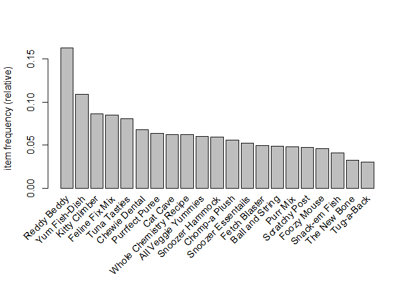

Market Basket Analysis
================
Njabulo Hlabangana
2022-07-23

## What is market basket analysis (MBA)?

This is a tried and tested technique that is used to ascertain
association rules in a data set. It is mainly used by retailers to
determine which items are often bought together as a ‘basket’. The
technique,essentially, helps retailers determine how likely it is for a
shopper to buy a particular product given that they have already bought
a particular set of product(s).

Brick and motor sellers can use MBA to allocate shelve space - trying as
much as possible to ensure that products that tend to be bought together
are kept as close to each other as possible. This helps make shopping
convenient for customers and can potentially boost sells. Online
retailers can use MBA to come up with product recommendations based on
the products they already have in their shopping carts in the process of
shopping.

## Dataset Used In The Analysis

The data was obtained from the Meta Marketing Analytics Course that I
did on Coursera. It was used for different kinds of analysis there and I
figured it could be great to go a step further and perform MBA on it.

The data contains transactions on a small company - Inu & Neko that
specializes in selling pet (cats and dogs) food, toys, bedding and other
treats.

``` r
#loading packages to be used in the analysis
library(tidyverse)
library(arulesViz)
```

## Loading the data

A quick look at at the data shows that it is arranged in a **single**
format. This is a format in which a transaction ID is assigned to a
basket (collection of items bought together) and every item in that
basket is identified using that transaction ID. The transaction ID are
arranged as rows. This means that a basket with three items will have
three rows in that data set, each row with the same ID but different
items.

``` r
setwd('/Users/hlaba/Documents/Custom Office Templates/BA') # setting the working directory to the folder that contains the data set
dat <- read.csv('inu_neko_orderline_clean.csv') # reading in the csv file
head(dat)
```

    ##   trans_id    prod_upc cust_id trans_timestamp trans_year trans_month trans_day
    ## 1 10300097 7.19638e+11 1001019         35:21.4       2021           1         1
    ## 2 10300093 7.32015e+10 1001015         33:37.5       2021           1         1
    ## 3 10300093 7.19638e+11 1001015         33:37.5       2021           1         1
    ## 4 10300093 4.41531e+11 1001015         33:37.5       2021           1         1
    ## 5 10300093 7.33427e+11 1001015         33:37.5       2021           1         1
    ## 6 10300091 3.44934e+11 1001012         08:32.2       2021           1         1
    ##   trans_hour trans_quantity cust_age cust_state prod_price      prod_title
    ## 1          1              1       20   New York      72.99        Cat Cave
    ## 2          1              1       34   New York      18.95  Purrfect Puree
    ## 3          1              1       34   New York      72.99        Cat Cave
    ## 4          1              2       34   New York      28.45 Ball and String
    ## 5          1              1       34   New York      18.95   Yum Fish-Dish
    ## 6          1              1       26 New Jersey      24.95   Fetch Blaster
    ##   prod_category prod_animal_type total_sales
    ## 1       bedding              cat       72.99
    ## 2         treat              cat       18.95
    ## 3       bedding              cat       72.99
    ## 4           toy              cat       56.90
    ## 5          food              cat       18.95
    ## 6           toy              dog       24.95

## Needed Columns

Only two columns will be needed for the analysis viz, transaction ID and
product name. The code below makes a dataframe out of those two columns.
Since the function used to read transactions cannot read dataframes, the
dataframe will be converted to a csv file and saved in the same working
directory.

``` r
transactions <- dat %>% select(as.factor('trans_id'),as.factor('prod_title'))
head(transactions)
```

    ##   trans_id      prod_title
    ## 1 10300097        Cat Cave
    ## 2 10300093  Purrfect Puree
    ## 3 10300093        Cat Cave
    ## 4 10300093 Ball and String
    ## 5 10300093   Yum Fish-Dish
    ## 6 10300091   Fetch Blaster

``` r
write.csv(transactions,'/Users/hlaba/Documents/Custom Office Templates/BA/transactions.csv',row.names = F)
```

## Reading in the transaction

The data frame has to be converted into a format that can the handled by
the arules package as shown below.The inspect command is used together
with the head command to show the selected number of baskets and their
respective transaction IDs.

``` r
purchases <- read.transactions('transactions.csv',format = 'single', sep = ",",cols = c(1,2),header = T) # reading the two columns of the single format dataframe.
inspect(head(purchases,5))
```

    ##     items              transactionID
    ## [1] {Fetch Blaster}         10300091
    ## [2] {Kitty Climber}         10300092
    ## [3] {Ball and String,               
    ##      Cat Cave,                      
    ##      Purrfect Puree,                
    ##      Yum Fish-Dish}         10300093
    ## [4] {Chewie Dental}         10300094
    ## [5] {Purrfect Puree}        10300095

## Some exploratory data analysis

To get a better view of the data, we will use the summary command. This
shows that: there is a total of 28022 transactions involving 21
different items offered by the Inu & Neko.  
The most common basket size is actually 1 with 20808 transactions. Reddy
Beddy is the most frequently purchased product. This is also shown
clearly in the frequency plot below

``` r
summary(purchases)
```

    ## transactions as itemMatrix in sparse format with
    ##  28022 rows (elements/itemsets/transactions) and
    ##  21 columns (items) and a density of 0.06423524 
    ## 
    ## most frequent items:
    ##    Reddy Beddy  Yum Fish-Dish  Kitty Climber Feline Fix Mix   Tuna Tasties 
    ##           4563           3048           2410           2386           2251 
    ##        (Other) 
    ##          23142 
    ## 
    ## element (itemset/transaction) length distribution:
    ## sizes
    ##     1     2     3     4     5     6 
    ## 20809  5139  1661   343    62     8 
    ## 
    ##    Min. 1st Qu.  Median    Mean 3rd Qu.    Max. 
    ##   1.000   1.000   1.000   1.349   2.000   6.000 
    ## 
    ## includes extended item information - examples:
    ##               labels
    ## 1 All Veggie Yummies
    ## 2    Ball and String
    ## 3           Cat Cave
    ## 
    ## includes extended transaction information - examples:
    ##   transactionID
    ## 1      10300091
    ## 2      10300092
    ## 3      10300093

``` r
itemFrequencyPlot(purchases,topN = 21, type = 'relative')
```

<!-- -->

## Finding the association rules

The association rules are found using the appriori algorithm as shown
below. **Support** refers to the count of a particular basket as a
proportion of the total number of unique baskets. The entered value for
support is the threshold needed for the basket to be included. A higher
value results in a fewer baskets. In this case the value is 0.01 %. This
was chosen because backet sizes greater than one constitute a small
proportion of the transactions - 25.74%. The **minlen** and **maxlen**
arguments stipulate the minimum and and maximum basket size
respectively. The **confidence** value is the minimum posterior
probability for a particular item to be in bought given a particular
basket. More on this in the interpretation of output. When **verbose**
is set to TRUE the algorithm will display the steps it goes through on
the console. I do not think that is necessary so I set it to FALSE.

``` r
rules <- apriori(purchases, parameter = list(support = 0.0001,minlen = 2,maxlen = 6, confidence = 0.5),control = list(verbose = F))
```

## A quick look at the rules

The mined rules are ordered by **lift**. This is essentially the number
of times the item frequency(prior probability) is increased given that a
particular set of items in the left hand side(LHS) have already been
bought or are in the cart. Purrfect Puree has the highest lift - 11.78.
This means that a customer who has bought or wants to but the LHS items
(Feline Fix Mix,Kitty Climber,Purr Mix) is 11.78 times more likely to
buy Purrfect Puree than a customer who does not have those items in the
basket or has no intention of buying them. The confidence for the same
basket is 0.75. This essentially means that about 75% of the baskets
with the LHS items (Feline Fix Mix,Kitty Climber,Purr Mix) will also
contain the Purrfect Puree. It would therefore make more sense to
allocate shelf space in such a way that these items are close to each
other. If the shopping is done online, then Perrfect Puree should be
recommended to a customer who has bought Feline Fix Mix,Kitty Climber
and Purr Mix or has them in their cart.

``` r
inspect(head(sort(rules, by ="lift"),5))
```

    ##     lhs                         rhs                   support confidence     coverage      lift count
    ## [1] {Feline Fix Mix,                                                                                 
    ##      Kitty Climber,                                                                                  
    ##      Purr Mix}               => {Purrfect Puree} 0.0001070587       0.75 0.0001427450 11.780549     3
    ## [2] {Kitty Climber,                                                                                  
    ##      Snoozer Hammock,                                                                                
    ##      Yum Fish-Dish}          => {Chewie Dental}  0.0001070587       0.60 0.0001784312  8.853712     3
    ## [3] {Reddy Beddy,                                                                                    
    ##      Scratchy Post,                                                                                  
    ##      Tuna Tasties}           => {Chewie Dental}  0.0001070587       0.50 0.0002141175  7.378094     3
    ## [4] {Chewie Dental,                                                                                  
    ##      Snoozer Hammock,                                                                                
    ##      Yum Fish-Dish}          => {Kitty Climber}  0.0001070587       0.60 0.0001784312  6.976432     3
    ## [5] {Foozy Mouse,                                                                                    
    ##      Purrfect Puree,                                                                                 
    ##      Whole Chemistry Recipe} => {Reddy Beddy}    0.0001070587       1.00 0.0001070587  6.141135     3

## Visualization of Results

The following graphs help to visualize the mined rules. The first is
called a grouped graph and it arranges rules by order of lift and
support. AS expected the rule with the highest lift as discussed above
appears at the top. The number of rules in the graph was reduced to 5 to
avoid clutter.

``` r
plot(unique(rules), method = 'grouped', k = 5)
```

<!-- -->

``` r
plot(rules,method = 'graph')
```

<!-- -->

## Conclusion

Based on its structure, the dataset lends itself well to analysis using
market basket analysis. However, the fact that the majority (about 76%)
of the baskets are one-item baskets makes the sample size for mining
association rules very small in ways that can affect the reliability of
the results. The principles and methods do, however, remain the same and
applicable to bigger datasets.
